<p align="center">
  
  <br>
</p>

<h1 align="center">不忙脚本盒子 / BmScriptsBox</h1>

<p align="center">
  <strong>Windows 跨语言脚本调度与管理软件</strong>
  <br>
  零门槛上手 · 全自动化环境部署 · 海量脚本一键运行
</p>

<p align="center">
  
  
  
  
</p>
<p align="center">
  <a href="https://www.bm-box.cn">官网</a> ·
  <a href="https://www.bm-box.cn/help">帮助中心</a> ·
  <a href="https://www.bm-box.cn/feedback">需求反馈</a>
  <br>
  <sub>Windows 10/11 · 完全免费 · 无功能限制</sub>
</p>

---

## 简介

**不忙脚本盒子** 是一款 Windows 跨语言的桌面脚本管理工具，主打**零配置、全场景、易上手、高稳定**，内置了办公、图像、音视频、系统、AI 等各类常用场景的优质脚本，支持多语言脚本一键部署、自动化调度、全局快捷调用，全方位满足日常办公、批量处理、自定义自动化需求。核心功能特性如下：

---

## 功能特性

### 🚀 零门槛上手

| 特性          | 功能说明                                                    |
| ----------- | ------------------------------------------------------- |
| **零配置开箱即用** | 搭载可视化图形操作界面，所有脚本支持一键安装、一键运行，无需手动搭建、配置运行环境，新手零基础直接使用。    |
| **海量优质脚本库** | 内置精选脚本库，全面覆盖日常办公、数据处理、文件操作、系统运维等全品类需求，支持关键词快速检索，一键部署启用。 |
| **声明式极简接入** | 无需集成基类、无需安装SDK，仅通过一个TOML配置文件，即可快速将自定义脚本接入脚本盒子，接入流程极简高效。 |

### ⚡ 高效触发

| 特性           | 功能说明                                                          |
| ------------ | ------------------------------------------------------------- |
| **全局快捷键唤起**  | 支持为任意脚本绑定全局热键，随时随地通过快捷键一键唤起执行，可自动带入选中内容作为脚本入参，操作高效无卡顿。        |
| **系统右键集成**   | 脚本深度集成系统右键菜单，选中文件/文件夹后右键即可一键启动对应脚本，自动携带文件路径入参，省去手动复制路径步骤。     |
| **超级复制快捷入参** | 独创快捷触发方式，选中文本后双击 `Ctrl+C+C`，可一键将剪贴板内容自动作为入参拉起对应脚本，适配高频文本处理场景。 |
| **灵活定时无人值守** | 内置高性能定时任务引擎，支持自定义时分、每日/每周/每月等循环周期，脚本可全自动定时运行，实现无人值守自动化作业。     |

### 🛠️ 稳定适配

| 特性           | 功能说明                                                          |
| ------------ | ------------------------------------------------------------- |
| **全跨语言支持**   | 支持 Python、JavaScript、PowerShell、Bat、AutoHotkey、EXE、HTML 多类型文件 |
| **智能依赖自动管理** | 自动识别脚本所需的运行依赖与环境版本，全自动完成依赖下载、安装、部署，同时智能清理冗余依赖，无需手动运维。         |
| **独立隔离运行环境** | 为每一个脚本配备独立虚拟运行环境，彻底隔离不同脚本的版本冲突、依赖冲突，保障脚本运行安全、稳定、互不干扰。         |

### 💾 资源优化

| 特性             | 功能说明                                                               |
| -------------- | ------------------------------------------------------------------ |
| **依赖全局缓存**     | 针对 Python、Node\.js 依赖采用硬链接缓存机制，实现多脚本、多项目依赖共享，杜绝重复下载、大幅节省磁盘空间与加载时间。 |
| **CLI 工具复用**   | 统一托管 FFmpeg、Pandoc 等常用命令行工具，通过Shim挂载与PATH统一配置，一次下载、多项目复用           |
| **智能环境匹配**     | 系统依据项目脚本中声明的语言版本（如 Python、Node.js、AHK 等），自动匹配并激活最优可用版本，无需手动切换      |
| **GitHub下载加速** | 依据脚本声明，自动识别需从 GitHub 下载的源码仓库与二进制软件，并通过配置代理链路实现下载加速                 |

---


## 界面预览

<div style="display: flex; gap: 10px; justify-content: center;">
  
  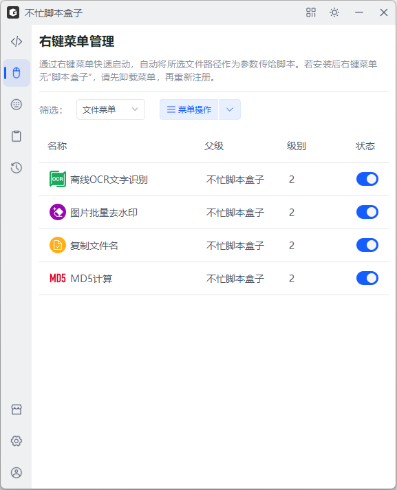
  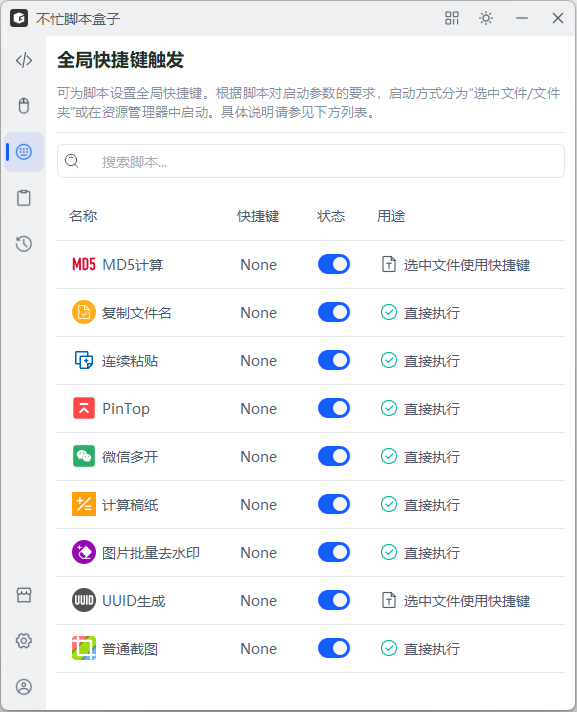
</div>
<br>
<div style="display: flex; gap: 10px; justify-content: center;">
  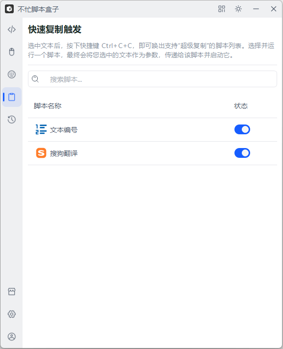
  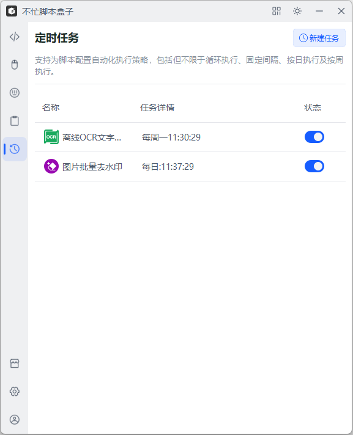
  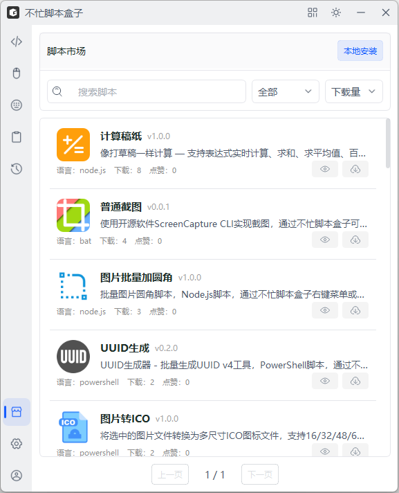
</div>
<br>
<div style="display: flex; gap: 10px; justify-content: center;">
  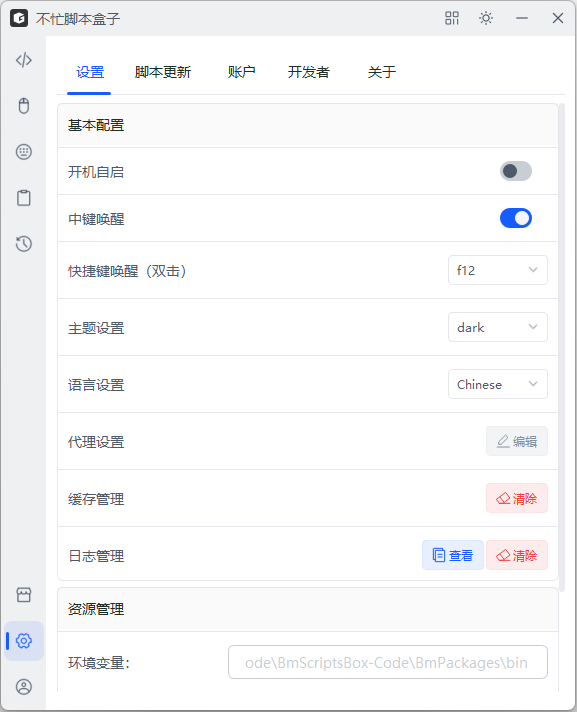
  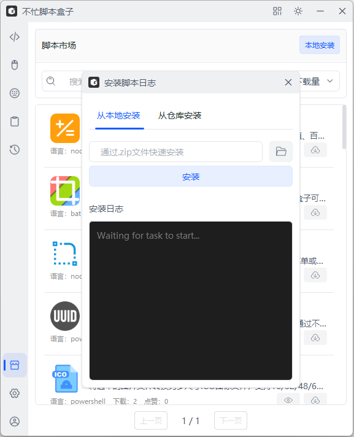
  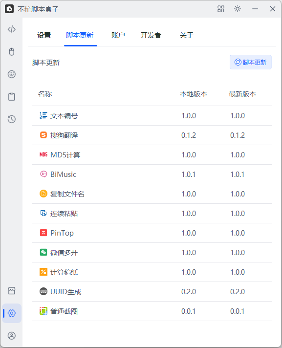
</div>

### 操作演示

> 提供脚本安装与多类触发运行方式的动画演示，脚本触发逻辑由脚本作者进行声明配置，并在软件专属界面可视化展示；用户日常操作场景下，几乎无需唤起不忙脚本盒子主程序窗口


<p align="center">
  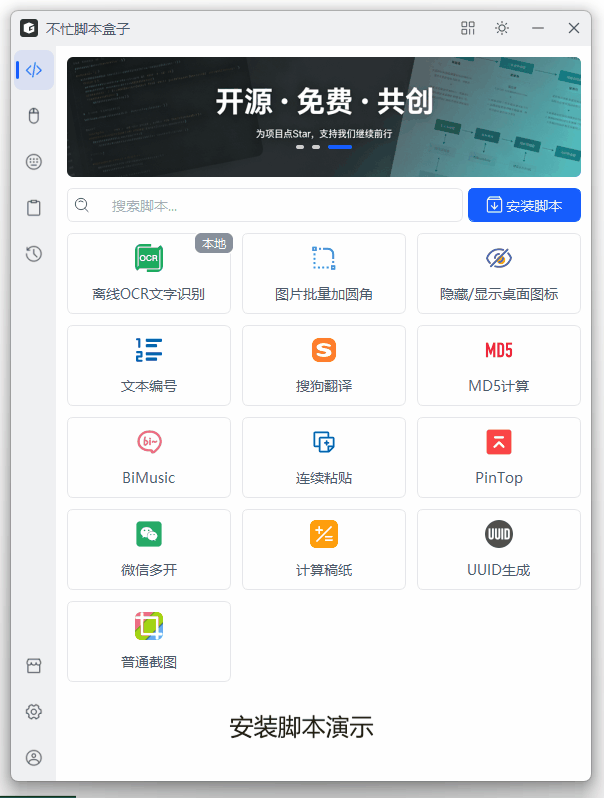
  <br>
  <em>安装脚本动画演示</em>
</p>

<p align="center">
  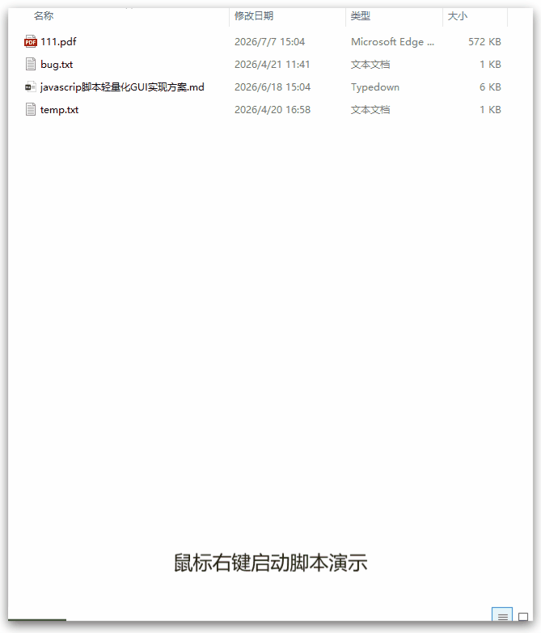
  <br>
  <em>右键执行脚本动画演示</em>
</p>

<p align="center">
  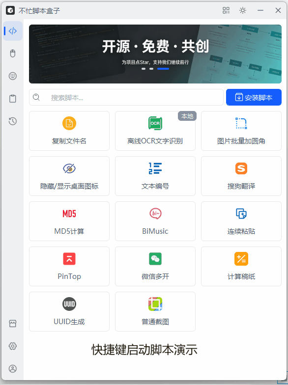
  <br>
  <em>快捷键执行脚本动画演示</em>
</p>

<p align="center">
  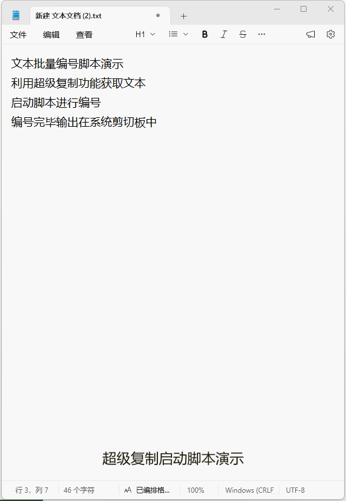
  <br>
  <em>超级复制执行脚本动画演示</em>
</p>

<p align="center">
  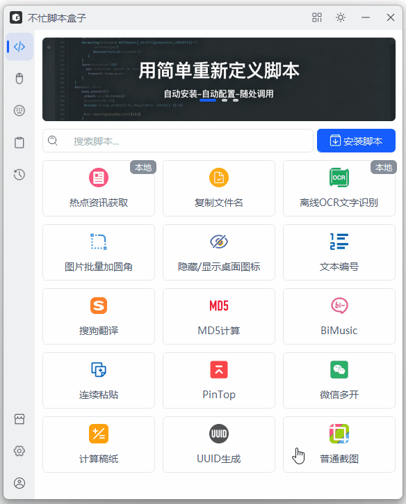
  <br>
  <em>定时任务演示</em>
</p>

---

### 项目结构

```
BmScriptsBox/
├── app/                        # 核心应用代码
│   ├── cloud/                  # 云端服务（脚本市场、更新）
│   ├── data/                   # 数据层（SQLite 数据库）
│   ├── resources/              # 资源文件（图标、i18n、语言包）
│   ├── servers/                # 后端服务层
│   │   ├── context/            # 右键菜单管理
│   │   ├── environment/        # 运行时环境部署（Python/Node.js/AHK）
│   │   ├── explorer/           # 文件浏览器集成
│   │   ├── http_local/         # 本地 HTTP 接口
│   │   ├── monitor/            # 监控服务
│   │   ├── packages/           # 包管理器（uv/python/node/pnpm 分发）
│   │   ├── scheduled_core/     # 定时任务引擎
│   │   └── scripts/            # 脚本安装/管理
│   ├── utils/                  # 工具函数
│   ├── view/                   # 前端 UI 层
│   │   ├── context_ui/         # 右键菜单 UI
│   │   ├── fast_text_ui/       # 快捷文本 UI
│   │   ├── hotkey_ui/          # 热键设置 UI
│   │   ├── index_ui/           # 主窗口
│   │   ├── scheduled_ui/       # 定时任务 UI
│   │   ├── script_ui/          # 脚本管理 UI
│   │   ├── setting_ui/         # 设置 UI
│   │   └── update_ui/          # 更新 UI
│   └── works/                  # 工作线程
├── main.py                     # 应用入口
├── pyproject.toml              # Python 项目配置
└── LICENSE                     # AGPL-3.0 许可证
```

### 核心技术栈

| 组件     | 技术选型                                                          |
| ------ | ------------------------------------------------------------- |
| GUI 框架 | PySide2 (Qt 5.15)                                             |
| UI 组件库 | [XSideUI](https://github.com/bmscriptsbox/xsideui)（PySide美化库） |
| 数据库    | Peewee ORM + SQLite                                           |
| 本地 API | Flask (嵌入式 HTTP 服务)                                           |
| 包管理    | uv (Python 依赖) / pnpm (Node 依赖)                               |
| 运行时分发  | 自研 PackagesManager (自动下载 uv/python/node/pnpm)                 |
| 版本管理   | pydantic 配置模型                                                 |
| 热键监听   | pynput / keyboard                                             |
| 定时调度   | schedule                                                      |

---

## 安装

### 方式一：下载安装包

从 [GitHub Releases](https://github.com/bmscriptsbox/BmScriptsBox/releases) 下载最新的安装包，双击安装即可。

### 方式二：从源码运行

```bash
# 1. 克隆仓库
git clone https://github.com/bmscriptsbox/BmScriptsBox.git
cd BmScriptsBox

# 2. 确保 Python ≥ 3.8
python --version

#3. 创建虚拟环境
uv venv

# 4. 同步依赖
uv sync

# 5. 运行
python main.py
```

> **注意**：首次运行时会自动下载 uv、Python 嵌入式运行时等依赖，请保持网络畅通。

---

## 脚本开发

开发者可以基于 [TOML 声明式配置](https://www.bm-box.cn./help/api/pei-zhi-wen-jian) 编写脚本，实现一键接入：

```toml
[bmscriptsbox]

# ====== 1. 基本信息 ======
[bmscriptsbox.info]
id = "xxxxxxxx-xxxx-xxxx-xxxx-xxxxxxxxxxxx"   # UUID v4（必须）
name = "文件分类器"                            # 脚本显示名称（必须，至少1个字符）
desc = "自动按文件类型分类整理"                  # 描述说明（可选）
icon = "icon/logo.png"                        # 图标路径（相对路径，可选）
version = "1.0.0"                             # 语义化版本号（必须，格式: x.y.z）

# ====== 2. 运行环境 ======
[bmscriptsbox.runtime]
language = "python"               # 脚本语言（必须，见支持列表）
language_version = ">=3.8"        # 语言版本要求（所有语言必填，bat/exe 可填 >=0.0.0）
entry = "main.py"                 # 入口文件路径（必须，相对路径）
terminal = "always"               # 终端模式（可选，建议始终显式填写）
binaries = [{name = "7zip"}]      # 依赖的外部二进制工具（可选）

# ====== 3. 触发器配置 ======
[bmscriptsbox.triggers]

  [bmscriptsbox.triggers.context_menu]
  enabled = true
  targets = ["files", "directory", "background"]
  filters = [".txt", ".md"]

  [bmscriptsbox.triggers.shortcut]
  enabled = true
  input_type = "files"
  filters = [".txt"]

  [bmscriptsbox.triggers.quick_copy]
  enabled = false

# ====== 4. 输入参数定义 ======
[[bmscriptsbox.inputs]]
name = "target_paths"
type = "paths"
exts = [".txt", ".md", ".py"]

# ====== 5. 输出参数定义（预留，暂未使用）=====
[[bmscriptsbox.outputs]]
name = "result"
type = "text"

# ====== 6. 工作流配置（预留，暂未使用）=====
[bmscriptsbox.workflow]
workflow_enabled = true
```

详细脚本开发文档请参考 [脚本开发指南](https://www.bm-box.cn/help/api)。

---

## 贡献指南

欢迎贡献脚本、提交 Issue 或 Pull Request！

1. Fork 本仓库
2. 创建特性分支 (`git checkout -b feature/amazing-feature`)
3. 提交改动 (`git commit -m 'Add amazing feature'`)
4. 推送到分支 (`git push origin feature/amazing-feature`)
5. 提交 Pull Request

---

## 许可证与使用限制

### 开源许可

本项目基于 **GNU Affero General Public License v3 (AGPL-3.0)** 开源。

### 禁止商用

**本项目仅供个人学习、研究及非商业用途。未经作者明确书面授权，任何个人或组织不得将本软件用于任何商业目的，包括但不限于：**

- 将本软件或修改版本直接用于商业产品销售
- 将本软件打包为商业服务的一部分进行收费
- 利用本软件搭建商业服务平台

如需商业授权，请联系作者：[bmscriptsbox@163.com](mailto:bmscriptsbox@163.com)

### 版权

Copyright © 2026 綦恒智 (Qi Hengzhi)

---


